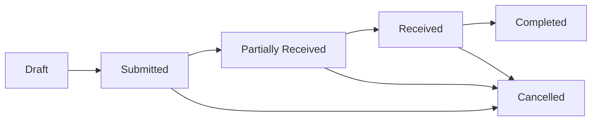

# Simple Purchase Order - Technical Specification

## Overview

This document outlines the technical specifications for a simplified Purchase Order module that reduces complexity while maintaining core procurement functionality. The module supports basic purchasing workflows with essential features only.

## System Architecture

### Core Components
1. **Purchase Order Entity** - Main transaction document
2. **Purchase Order Item Entity** - Line items with product details
3. **Business Logic Layer** - Validation and calculation engine
4. **Status Management** - Workflow state transitions
5. **Integration Points** - Connections to master data

### Technology Stack Requirements
- **Database**: Any relational database (MySQL, PostgreSQL, SQL Server, etc.)
- **Backend**: Any server-side language (Python, Java, C#, Node.js, etc.)
- **Frontend**: Any UI framework (React, Vue, Angular, etc.)
- **API Layer**: REST API for client-server communication

## Database Schema

### Purchase Order (Main Entity)

| Field Name | Data Type | Length | Required | Default | Description |
|------------|-----------|---------|----------|---------|-------------|
| id | VARCHAR/UUID | 50 | Yes | AUTO | Primary key |
| naming_series | VARCHAR | 20 | Yes | 'SPO-.YYYY.-' | Document numbering |
| supplier_id | VARCHAR | 50 | Yes | NULL | Foreign key to Supplier |
| supplier_name | VARCHAR | 150 | No | NULL | Cached supplier name |
| transaction_date | DATE | - | Yes | TODAY | Order creation date |
| required_by_date | DATE | - | No | NULL | Delivery deadline |
| company_id | VARCHAR | 50 | Yes | NULL | Foreign key to Company |
| currency | VARCHAR | 3 | Yes | NULL | Transaction currency (ISO code) |
| conversion_rate | DECIMAL | 10,9 | Yes | 1.0 | Exchange rate to base currency |
| status | VARCHAR | 20 | Yes | 'Draft' | Current document status |
| net_total | DECIMAL | 15,2 | Yes | 0.00 | Sum of line item amounts |
| tax_rate | DECIMAL | 5,2 | No | 0.00 | Tax percentage |
| tax_amount | DECIMAL | 15,2 | Yes | 0.00 | Calculated tax amount |
| grand_total | DECIMAL | 15,2 | Yes | 0.00 | Final total amount |
| supplier_address_id | VARCHAR | 50 | No | NULL | Foreign key to Address |
| contact_person_id | VARCHAR | 50 | No | NULL | Foreign key to Contact |
| remarks | TEXT | - | No | NULL | Additional notes |
| amended_from | VARCHAR | 50 | No | NULL | Reference to original document |
| docstatus | INT | 1 | Yes | 0 | Document submission status |
| created_at | TIMESTAMP | - | Yes | NOW() | Record creation timestamp |
| updated_at | TIMESTAMP | - | Yes | NOW() | Last modification timestamp |
| created_by | VARCHAR | 50 | Yes | NULL | User who created record |
| updated_by | VARCHAR | 50 | Yes | NULL | User who last modified record |

### Purchase Order Item (Child Entity)

| Field Name | Data Type | Length | Required | Default | Description |
|------------|-----------|---------|----------|---------|-------------|
| id | VARCHAR/UUID | 50 | Yes | AUTO | Primary key |
| parent_id | VARCHAR | 50 | Yes | NULL | Foreign key to Purchase Order |
| item_code | VARCHAR | 50 | Yes | NULL | Foreign key to Item master |
| item_name | VARCHAR | 150 | No | NULL | Cached item name |
| description | TEXT | - | No | NULL | Item description |
| qty | DECIMAL | 10,3 | Yes | 0.000 | Ordered quantity |
| uom | VARCHAR | 20 | Yes | NULL | Unit of measure |
| rate | DECIMAL | 15,4 | Yes | 0.0000 | Unit price |
| amount | DECIMAL | 15,2 | Yes | 0.00 | Line total (qty × rate) |
| warehouse_id | VARCHAR | 50 | Yes | NULL | Target warehouse |
| required_by_date | DATE | - | No | NULL | Item-specific delivery date |
| line_sequence | INT | 3 | Yes | 1 | Display order |
| created_at | TIMESTAMP | - | Yes | NOW() | Record creation timestamp |
| updated_at | TIMESTAMP | - | Yes | NOW() | Last modification timestamp |

### Indexes for Performance

```sql
-- Purchase Order indexes
CREATE INDEX idx_po_supplier ON purchase_order (supplier_id, transaction_date);
CREATE INDEX idx_po_company ON purchase_order (company_id, status);
CREATE INDEX idx_po_status ON purchase_order (status, docstatus);
CREATE INDEX idx_po_dates ON purchase_order (transaction_date, required_by_date);

-- Purchase Order Item indexes
CREATE INDEX idx_poi_parent ON purchase_order_item (parent_id, line_sequence);
CREATE INDEX idx_poi_item ON purchase_order_item (item_code, warehouse_id);
```

## Business Logic Specifications

### Validation Rules

#### Purchase Order Level Validations
1. **Date Validation**: `required_by_date >= transaction_date`
2. **Supplier Validation**: Must reference valid, active supplier
3. **Company Validation**: Must reference valid company
4. **Currency Validation**: Must be valid currency code
5. **Exchange Rate Validation**: Must be > 0
6. **Items Validation**: Must have at least one line item

#### Purchase Order Item Level Validations
1. **Quantity Validation**: `qty > 0`
2. **Rate Validation**: `rate > 0`
3. **Item Validation**: Must reference valid, active item
4. **Warehouse Validation**: Must reference valid warehouse
5. **UOM Validation**: Must be valid unit of measure for the item

### Calculation Engine

#### Line Item Calculations
```pseudocode
FOR each item in purchase_order_items:
    item.amount = item.qty * item.rate
```

#### Document Total Calculations
```pseudocode
net_total = SUM(item.amount for item in items)
tax_amount = net_total * (tax_rate / 100)
grand_total = net_total + tax_amount
```

### Status Workflow

#### Status Transitions


#### Status Rules
1. **Draft (docstatus = 0)**: Editable, can be deleted
2. **Submitted (docstatus = 1)**: Immutable, can create receipts/invoices
3. **Partially Received**: Some items received
4. **Received**: All items received
5. **Completed**: Fully processed (received and billed)
6. **Cancelled (docstatus = 2)**: Reversed document

### Business Methods

#### Core Methods

##### validate()
```pseudocode
METHOD validate():
    validate_dates()
    validate_items()
    calculate_totals()
    set_status()
```

##### calculate_totals()
```pseudocode
METHOD calculate_totals():
    net_total = 0
    FOR each item in items:
        item.amount = item.qty * item.rate
        net_total += item.amount
    
    tax_amount = net_total * (tax_rate / 100)
    grand_total = net_total + tax_amount
```

##### submit()
```pseudocode
METHOD submit():
    validate()
    docstatus = 1
    status = "Submitted"
    update_item_last_purchase_rates()
    save()
```

##### cancel()
```pseudocode
METHOD cancel():
    IF status IN ["Partially Received", "Received"]:
        THROW "Cannot cancel received purchase order"
    
    docstatus = 2
    status = "Cancelled"
    save()
```

## API Specifications

### Core Endpoints

#### GET /api/purchase-orders
- **Purpose**: List purchase orders with filtering
- **Parameters**: `supplier_id`, `status`, `date_from`, `date_to`, `limit`, `offset`
- **Response**: Paginated list of purchase orders

#### POST /api/purchase-orders
- **Purpose**: Create new purchase order
- **Body**: Purchase order JSON with items array
- **Response**: Created purchase order with generated ID

#### GET /api/purchase-orders/{id}
- **Purpose**: Get specific purchase order
- **Response**: Complete purchase order with items

#### PUT /api/purchase-orders/{id}
- **Purpose**: Update existing purchase order
- **Body**: Updated purchase order JSON
- **Response**: Updated purchase order

#### POST /api/purchase-orders/{id}/submit
- **Purpose**: Submit purchase order for processing
- **Response**: Submitted purchase order with status change

#### POST /api/purchase-orders/{id}/cancel
- **Purpose**: Cancel submitted purchase order
- **Response**: Cancelled purchase order

### Integration Endpoints

#### POST /api/purchase-orders/{id}/create-receipt
- **Purpose**: Generate purchase receipt from PO
- **Response**: Created purchase receipt document

#### POST /api/purchase-orders/{id}/create-invoice
- **Purpose**: Generate purchase invoice from PO
- **Response**: Created purchase invoice document

## Security Specifications

### Permission Matrix

| Role | Create | Read | Update | Submit | Cancel | Delete |
|------|--------|------|--------|--------|--------|--------|
| Purchase User | ✓ | ✓ | ✓ | ✓ | ✗ | ✓ |
| Purchase Manager | ✓ | ✓ | ✓ | ✓ | ✓ | ✓ |
| Stock User | ✗ | ✓ | ✗ | ✗ | ✗ | ✗ |

### Data Access Rules
1. **Company Isolation**: Users can only access data from their assigned companies
2. **Supplier Restrictions**: Optional supplier-based access control
3. **Document Status**: Draft documents editable by creator, submitted documents read-only

## Performance Requirements

### Response Time Targets
- **List Operations**: < 500ms for 100 records
- **Single Record**: < 200ms
- **Create/Update**: < 1000ms
- **Calculations**: < 100ms

### Scalability Targets
- **Concurrent Users**: Support 50+ simultaneous users
- **Data Volume**: Handle 100,000+ purchase orders
- **Items per PO**: Support 500+ line items per document

## Error Handling

### Error Categories
1. **Validation Errors** (400): Business rule violations
2. **Not Found Errors** (404): Resource doesn't exist
3. **Permission Errors** (403): Insufficient access rights
4. **Server Errors** (500): System failures

### Error Response Format
```json
{
  "error": true,
  "message": "Human readable error message",
  "code": "ERROR_CODE",
  "details": {
    "field": "specific field if applicable",
    "value": "invalid value"
  }
}
```

## Integration Points

### Master Data Dependencies
1. **Supplier Master**: Supplier information and defaults
2. **Item Master**: Product catalog with pricing
3. **Company Master**: Organization settings
4. **Currency Master**: Exchange rates
5. **Warehouse Master**: Inventory locations
6. **UOM Master**: Units of measure

### Document Integrations
1. **Material Request**: Source for item requirements
2. **Supplier Quotation**: Reference for pricing
3. **Purchase Receipt**: Goods receiving
4. **Purchase Invoice**: Billing document

This specification provides the foundation for implementing a robust yet simplified Purchase Order system in any technology stack while maintaining business process integrity and data consistency.