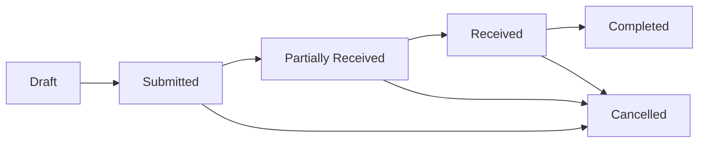

# Purchase Order Status Management - Comprehensive Guide

## Overview

This document provides complete guidance on the Purchase Order status management system, covering workflow definitions, business rules, technical implementation, and best practices. The status system ensures proper procurement control while maintaining flexibility for different business scenarios.

## 📊 Status Workflow Overview

The Purchase Order follows a clear, linear progression through defined business states:



### **Key Workflow Principles:**
- **Linear Progress**: Each status represents a clear business milestone
- **One-Way Flow**: Generally moves forward, with cancellation as exception
- **Role-Based Control**: Different users can perform different status transitions
- **Audit Trail**: All status changes are logged with user and timestamp

## 🏷️ Status Definitions

### **1. Draft (docstatus = 0)**
- **Purpose**: Initial creation and editing phase
- **Business Meaning**: Purchase order is being prepared, not yet committed
- **User Actions**: Full editing capabilities, can add/remove items, modify all details
- **System Behavior**: Document is mutable, can be deleted, no business impact
- **Who Can Access**: Purchase users who created it, Purchase managers
- **Visual Indicator**: Gray or blue indicator, "DRAFT" badge

**Business Rules:**
- Can be edited unlimited times
- Can be deleted without restrictions
- No notifications sent to suppliers
- No stock reservations made
- No financial commitments created

### **2. Submitted (docstatus = 1)**
- **Purpose**: Official purchase order ready for processing
- **Business Meaning**: Formal commitment to purchase, supplier authorization
- **User Actions**: No editing allowed, can only cancel or mark as received
- **System Behavior**: Document becomes immutable, enables downstream processes
- **Who Can Access**: All purchase users can view, only managers can cancel
- **Visual Indicator**: Green indicator, "SUBMITTED" badge

**Business Rules:**
- Document cannot be modified (immutable)
- Triggers supplier notification (if configured)
- Enables creation of Purchase Receipts
- Enables creation of Purchase Invoices
- Stock may be reserved (if configured)
- Financial commitment is recorded

### **3. Partially Received**
- **Purpose**: Some items have been received but order is incomplete
- **Business Meaning**: Partial delivery has occurred, remaining items pending
- **User Actions**: Can mark remaining items as received, can still cancel with approval
- **System Behavior**: Tracks percentage completion, enables partial invoicing
- **Who Can Access**: Warehouse staff can update, purchase team can view
- **Visual Indicator**: Yellow/orange indicator, "PARTIALLY RECEIVED" badge

**Business Rules:**
- Percentage received is calculated automatically
- Stock entries created for received items
- Partial invoicing is allowed
- Remaining items can still be received
- Can be cancelled with manager approval
- Tracks individual item receipt status

### **4. Received**
- **Purpose**: All items have been physically received
- **Business Meaning**: Goods delivery is complete, ready for final processing
- **User Actions**: Can mark as completed when billing is done
- **System Behavior**: Cannot be cancelled easily, enables full invoice creation
- **Who Can Access**: Purchase and accounts teams
- **Visual Indicator**: Blue indicator, "RECEIVED" badge

**Business Rules:**
- 100% of items have been received
- All stock entries are complete
- Full invoicing is enabled
- Cannot be cancelled without special approval
- Ready for accounts payable processing
- Quality control processes may be triggered

### **5. Completed**
- **Purpose**: All items received and all invoices processed
- **Business Meaning**: Purchase order lifecycle is finished, fully processed
- **User Actions**: Read-only, for reference and reporting only
- **System Behavior**: Final state, complete audit trail maintained
- **Who Can Access**: All users for reporting and reference
- **Visual Indicator**: Green checkmark, "COMPLETED" badge

**Business Rules:**
- 100% received and 100% billed
- All financial transactions complete
- All stock movements finalized
- Cannot be modified or cancelled
- Available for historical reporting
- Complete audit trail preserved

### **6. Cancelled (docstatus = 2)**
- **Purpose**: Purchase order has been reversed/cancelled
- **Business Meaning**: Order was terminated before completion
- **User Actions**: Read-only, for audit purposes only
- **System Behavior**: Cannot be reactivated, maintains complete history
- **Who Can Access**: All users for audit and reference
- **Visual Indicator**: Red indicator, "CANCELLED" badge

**Business Rules:**
- Cannot be reactivated or modified
- All related stock entries are reversed
- Financial commitments are reversed
- Supplier notifications may be sent
- Cancellation reason is required
- Complete audit trail is maintained

## 🔄 Status Transitions and Business Rules

### **Valid Transitions Matrix:**

| From Status | To Status | Condition | Required Role | Additional Requirements |
|-------------|-----------|-----------|---------------|------------------------|
| Draft | Submitted | Has items, valid data | Purchase User | Items qty > 0, valid supplier |
| Draft | Cancelled | Any time | Purchase User | None |
| Submitted | Partially Received | Some items received | Warehouse Staff | At least one item marked received |
| Submitted | Received | All items received | Warehouse Staff | All items marked received |
| Submitted | Cancelled | Not yet received | Purchase Manager | No items received yet |
| Partially Received | Received | Remaining items received | Warehouse Staff | All remaining items received |
| Partially Received | Cancelled | Manager approval | Purchase Manager | Cancellation reason required |
| Received | Completed | All invoices processed | Accounts Team | 100% billed |
| Received | Cancelled | Special circumstances | Purchase Manager | Special approval workflow |

### **Detailed Validation Logic:**

```pseudocode
FUNCTION validate_status_transition(current_status, new_status, user_role, purchase_order):
    
    // Draft status transitions
    IF current_status == "Draft":
        IF new_status == "Submitted":
            REQUIRE: purchase_order.items.count > 0
            REQUIRE: purchase_order.supplier_id IS NOT NULL
            REQUIRE: purchase_order.company_id IS NOT NULL
            REQUIRE: ALL items have qty > 0 AND rate > 0
            REQUIRE: user_role IN ["Purchase User", "Purchase Manager"]
            
        ELSIF new_status == "Cancelled":
            REQUIRE: user_role IN ["Purchase User", "Purchase Manager"]
            // No additional requirements for draft cancellation
            
        ELSE:
            THROW ValidationError("Invalid transition from Draft")
    
    // Submitted status transitions
    ELSIF current_status == "Submitted":
        IF new_status == "Partially Received":
            REQUIRE: user_role IN ["Warehouse Staff", "Purchase Manager"]
            REQUIRE: at_least_one_item_received()
            REQUIRE: NOT all_items_received()
            
        ELSIF new_status == "Received":
            REQUIRE: user_role IN ["Warehouse Staff", "Purchase Manager"]
            REQUIRE: all_items_received()
            
        ELSIF new_status == "Cancelled":
            REQUIRE: user_role == "Purchase Manager"
            REQUIRE: no_items_received()
            REQUIRE: cancellation_reason IS NOT NULL
            
        ELSE:
            THROW ValidationError("Invalid transition from Submitted")
    
    // Partially Received status transitions
    ELSIF current_status == "Partially Received":
        IF new_status == "Received":
            REQUIRE: user_role IN ["Warehouse Staff", "Purchase Manager"]
            REQUIRE: all_remaining_items_received()
            
        ELSIF new_status == "Cancelled":
            REQUIRE: user_role == "Purchase Manager"
            REQUIRE: cancellation_reason IS NOT NULL
            REQUIRE: manager_approval_obtained()
            
        ELSE:
            THROW ValidationError("Invalid transition from Partially Received")
    
    // Received status transitions
    ELSIF current_status == "Received":
        IF new_status == "Completed":
            REQUIRE: user_role IN ["Accounts Team", "Purchase Manager"]
            REQUIRE: all_items_fully_billed()
            
        ELSIF new_status == "Cancelled":
            REQUIRE: user_role == "Purchase Manager"
            REQUIRE: special_approval_obtained()
            REQUIRE: detailed_cancellation_reason()
            
        ELSE:
            THROW ValidationError("Invalid transition from Received")
    
    // Completed and Cancelled are terminal states
    ELSIF current_status IN ["Completed", "Cancelled"]:
        THROW ValidationError("Cannot change status from terminal state")
    
    RETURN TRUE // Validation passed
```

## 🛠️ Technical Implementation

### **Database Schema for Status Management:**

```sql
-- Main purchase_order table status fields
CREATE TABLE purchase_order (
    -- ... other fields ...
    
    -- Primary status fields
    status VARCHAR(20) NOT NULL DEFAULT 'Draft',
    docstatus TINYINT NOT NULL DEFAULT 0,  -- 0=Draft, 1=Submitted, 2=Cancelled
    
    -- Progress tracking
    per_received DECIMAL(5,2) DEFAULT 0.00,  -- Percentage received (0-100)
    per_billed DECIMAL(5,2) DEFAULT 0.00,    -- Percentage billed (0-100)
    
    -- Status change tracking
    submitted_at TIMESTAMP NULL,              -- When submitted
    received_at TIMESTAMP NULL,               -- When fully received
    completed_at TIMESTAMP NULL,              -- When completed
    cancelled_at TIMESTAMP NULL,              -- When cancelled
    
    -- Cancellation details
    cancellation_reason TEXT NULL,           -- Required for cancelled orders
    cancelled_by VARCHAR(50) NULL,           -- Who cancelled the order
    
    -- Audit fields
    created_at TIMESTAMP DEFAULT CURRENT_TIMESTAMP,
    updated_at TIMESTAMP DEFAULT CURRENT_TIMESTAMP ON UPDATE CURRENT_TIMESTAMP,
    created_by VARCHAR(50) NOT NULL,
    updated_by VARCHAR(50) NOT NULL,
    
    -- Constraints
    CONSTRAINT chk_po_status CHECK (status IN (
        'Draft', 'Submitted', 'Partially Received', 'Received', 'Completed', 'Cancelled'
    )),
    CONSTRAINT chk_po_docstatus CHECK (docstatus IN (0, 1, 2)),
    CONSTRAINT chk_po_percentages CHECK (
        per_received >= 0 AND per_received <= 100 AND
        per_billed >= 0 AND per_billed <= 100
    )
);

-- Status change audit table
CREATE TABLE purchase_order_status_log (
    id VARCHAR(50) PRIMARY KEY,
    purchase_order_id VARCHAR(50) NOT NULL,
    from_status VARCHAR(20),
    to_status VARCHAR(20) NOT NULL,
    changed_by VARCHAR(50) NOT NULL,
    changed_at TIMESTAMP DEFAULT CURRENT_TIMESTAMP,
    reason TEXT,
    additional_data JSON,
    
    CONSTRAINT fk_status_log_po FOREIGN KEY (purchase_order_id) 
        REFERENCES purchase_order(id) ON DELETE CASCADE
);

-- Indexes for performance
CREATE INDEX idx_po_status ON purchase_order (status, docstatus);
CREATE INDEX idx_po_progress ON purchase_order (per_received, per_billed);
CREATE INDEX idx_status_log_po ON purchase_order_status_log (purchase_order_id, changed_at);
```

### **Status Management Service Implementation:**

```python
from enum import Enum
from datetime import datetime
from typing import Optional, Dict, Any

class PurchaseOrderStatus(Enum):
    DRAFT = "Draft"
    SUBMITTED = "Submitted"
    PARTIALLY_RECEIVED = "Partially Received"
    RECEIVED = "Received"
    COMPLETED = "Completed"
    CANCELLED = "Cancelled"

class PurchaseOrderStatusManager:
    
    def __init__(self, purchase_order):
        self.purchase_order = purchase_order
    
    def submit(self, user) -> Dict[str, Any]:
        """Submit purchase order (Draft → Submitted)"""
        self._validate_transition(
            PurchaseOrderStatus.DRAFT, 
            PurchaseOrderStatus.SUBMITTED, 
            user
        )
        
        # Validate business rules
        if not self.purchase_order.items.exists():
            raise ValidationError("Cannot submit purchase order without items")
        
        for item in self.purchase_order.items.all():
            if item.qty <= 0 or item.rate <= 0:
                raise ValidationError(f"Invalid quantity or rate for item {item.item_code}")
        
        # Update status
        old_status = self.purchase_order.status
        self.purchase_order.status = PurchaseOrderStatus.SUBMITTED.value
        self.purchase_order.docstatus = 1
        self.purchase_order.submitted_at = datetime.now()
        self.purchase_order.updated_by = user.email
        self.purchase_order.save()
        
        # Log status change
        self._log_status_change(old_status, PurchaseOrderStatus.SUBMITTED.value, user)
        
        # Business logic
        self._update_item_last_purchase_rates()
        self._send_supplier_notification()
        
        return {
            "status": self.purchase_order.status,
            "docstatus": self.purchase_order.docstatus,
            "submitted_at": self.purchase_order.submitted_at
        }
    
    def mark_received(self, received_items: list, user, notes: str = "") -> Dict[str, Any]:
        """Mark items as received (Submitted → Partially Received/Received)"""
        if self.purchase_order.docstatus != 1:
            raise ValidationError("Can only receive submitted purchase orders")
        
        if not self._has_warehouse_permission(user):
            raise ValidationError("Insufficient permissions to mark as received")
        
        # Update item receipt quantities
        total_items = self.purchase_order.items.count()
        fully_received_items = 0
        
        for item_data in received_items:
            item = self.purchase_order.items.get(id=item_data['item_id'])
            item.received_qty = item_data['received_qty']
            item.received_date = datetime.now()
            item.save()
            
            if item.received_qty >= item.qty:
                fully_received_items += 1
        
        # Calculate percentage and determine new status
        old_status = self.purchase_order.status
        self.purchase_order.per_received = (fully_received_items / total_items) * 100
        
        if self.purchase_order.per_received == 100:
            new_status = PurchaseOrderStatus.RECEIVED.value
            self.purchase_order.received_at = datetime.now()
        elif self.purchase_order.per_received > 0:
            new_status = PurchaseOrderStatus.PARTIALLY_RECEIVED.value
        else:
            raise ValidationError("No items were marked as received")
        
        self.purchase_order.status = new_status
        self.purchase_order.updated_by = user.email
        self.purchase_order.save()
        
        # Log status change
        self._log_status_change(old_status, new_status, user, reason=notes)
        
        # Create stock entries
        self._create_stock_entries(received_items)
        
        return {
            "status": self.purchase_order.status,
            "per_received": self.purchase_order.per_received,
            "received_at": self.purchase_order.received_at
        }
    
    def mark_completed(self, user) -> Dict[str, Any]:
        """Mark as completed (Received → Completed)"""
        if self.purchase_order.status != PurchaseOrderStatus.RECEIVED.value:
            raise ValidationError("Can only complete received purchase orders")
        
        if not self._has_accounts_permission(user):
            raise ValidationError("Insufficient permissions to mark as completed")
        
        # Verify all items are fully billed
        if self.purchase_order.per_billed < 100:
            raise ValidationError("Cannot complete order until fully billed")
        
        # Update status
        old_status = self.purchase_order.status
        self.purchase_order.status = PurchaseOrderStatus.COMPLETED.value
        self.purchase_order.completed_at = datetime.now()
        self.purchase_order.updated_by = user.email
        self.purchase_order.save()
        
        # Log status change
        self._log_status_change(old_status, PurchaseOrderStatus.COMPLETED.value, user)
        
        return {
            "status": self.purchase_order.status,
            "completed_at": self.purchase_order.completed_at
        }
    
    def cancel(self, reason: str, user, force: bool = False) -> Dict[str, Any]:
        """Cancel purchase order"""
        if not self._has_manager_permission(user):
            raise ValidationError("Only Purchase Managers can cancel orders")
        
        if not reason:
            raise ValidationError("Cancellation reason is required")
        
        # Validate cancellation rules
        if self.purchase_order.status in [PurchaseOrderStatus.RECEIVED.value, PurchaseOrderStatus.COMPLETED.value]:
            if not force or not self._has_special_approval(user):
                raise ValidationError("Cannot cancel received/completed orders without special approval")
        
        # Update status
        old_status = self.purchase_order.status
        self.purchase_order.status = PurchaseOrderStatus.CANCELLED.value
        self.purchase_order.docstatus = 2
        self.purchase_order.cancelled_at = datetime.now()
        self.purchase_order.cancellation_reason = reason
        self.purchase_order.cancelled_by = user.email
        self.purchase_order.updated_by = user.email
        self.purchase_order.save()
        
        # Log status change
        self._log_status_change(old_status, PurchaseOrderStatus.CANCELLED.value, user, reason=reason)
        
        # Reverse business transactions
        self._reverse_stock_entries()
        self._reverse_financial_entries()
        
        return {
            "status": self.purchase_order.status,
            "docstatus": self.purchase_order.docstatus,
            "cancelled_at": self.purchase_order.cancelled_at,
            "cancellation_reason": self.purchase_order.cancellation_reason
        }
    
    def _validate_transition(self, from_status: PurchaseOrderStatus, to_status: PurchaseOrderStatus, user):
        """Validate if status transition is allowed"""
        current_status = PurchaseOrderStatus(self.purchase_order.status)
        
        if current_status != from_status:
            raise ValidationError(f"Expected status {from_status.value}, got {current_status.value}")
        
        # Add role-based validation logic here
        # This would check user.role against allowed roles for each transition
    
    def _log_status_change(self, from_status: str, to_status: str, user, reason: str = ""):
        """Log status change for audit trail"""
        PurchaseOrderStatusLog.objects.create(
            purchase_order_id=self.purchase_order.id,
            from_status=from_status,
            to_status=to_status,
            changed_by=user.email,
            reason=reason,
            additional_data={
                "user_role": user.role,
                "ip_address": getattr(user, 'ip_address', None),
                "user_agent": getattr(user, 'user_agent', None)
            }
        )
    
    def _has_warehouse_permission(self, user) -> bool:
        """Check if user has warehouse permissions"""
        return user.role in ['Warehouse Staff', 'Purchase Manager', 'System Admin']
    
    def _has_accounts_permission(self, user) -> bool:
        """Check if user has accounts permissions"""
        return user.role in ['Accounts Team', 'Purchase Manager', 'System Admin']
    
    def _has_manager_permission(self, user) -> bool:
        """Check if user has manager permissions"""
        return user.role in ['Purchase Manager', 'System Admin']
    
    def _has_special_approval(self, user) -> bool:
        """Check if user has special approval permissions"""
        return user.role == 'System Admin' or user.has_permission('special_po_cancel')
```

## 🔌 API Endpoints for Status Management

### **1. Submit Purchase Order**

**Endpoint:** `POST /api/purchase-orders/{id}/submit`

**Request Headers:**
```http
Authorization: Bearer <access_token>
Content-Type: application/json
```

**Response (200 OK):**
```json
{
  "success": true,
  "data": {
    "id": "SPO-2025-0001",
    "status": "Submitted",
    "docstatus": 1,
    "submitted_at": "2025-06-18T11:00:00Z",
    "updated_at": "2025-06-18T11:00:00Z",
    "updated_by": "user@company.com"
  },
  "message": "Purchase order submitted successfully"
}
```

### **2. Mark Items as Received**

**Endpoint:** `PATCH /api/purchase-orders/{id}/receive`

**Request Body:**
```json
{
  "received_items": [
    {
      "item_id": "SPO-2025-0001-1",
      "received_qty": 10,
      "warehouse_id": "WH-001"
    },
    {
      "item_id": "SPO-2025-0001-2",
      "received_qty": 5,
      "warehouse_id": "WH-001"
    }
  ],
  "notes": "All items received in good condition",
  "received_date": "2025-06-20"
}
```

**Response (200 OK):**
```json
{
  "success": true,
  "data": {
    "id": "SPO-2025-0001",
    "status": "Received",
    "per_received": 100.0,
    "received_at": "2025-06-20T14:30:00Z",
    "stock_entries": [
      {
        "entry_id": "STE-2025-0001",
        "type": "Receipt",
        "total_value": 1100.00
      }
    ]
  },
  "message": "Items received successfully"
}
```

### **3. Mark as Completed**

**Endpoint:** `POST /api/purchase-orders/{id}/complete`

**Request Body:**
```json
{
  "completion_notes": "All invoices processed and payments scheduled"
}
```

**Response (200 OK):**
```json
{
  "success": true,
  "data": {
    "id": "SPO-2025-0001",
    "status": "Completed",
    "per_received": 100.0,
    "per_billed": 100.0,
    "completed_at": "2025-06-25T16:00:00Z"
  },
  "message": "Purchase order completed successfully"
}
```

### **4. Cancel Purchase Order**

**Endpoint:** `POST /api/purchase-orders/{id}/cancel`

**Request Body:**
```json
{
  "reason": "Supplier unable to deliver on time",
  "force_cancel": false,
  "notify_supplier": true
}
```

**Response (200 OK):**
```json
{
  "success": true,
  "data": {
    "id": "SPO-2025-0001",
    "status": "Cancelled",
    "docstatus": 2,
    "cancelled_at": "2025-06-18T15:30:00Z",
    "cancellation_reason": "Supplier unable to deliver on time",
    "cancelled_by": "manager@company.com",
    "reversed_entries": [
      {
        "type": "Stock Entry",
        "entry_id": "STE-2025-0001-REV"
      }
    ]
  },
  "message": "Purchase order cancelled successfully"
}
```

### **5. Get Status History**

**Endpoint:** `GET /api/purchase-orders/{id}/status-history`

**Response (200 OK):**
```json
{
  "success": true,
  "data": {
    "purchase_order_id": "SPO-2025-0001",
    "status_history": [
      {
        "from_status": null,
        "to_status": "Draft",
        "changed_by": "user@company.com",
        "changed_at": "2025-06-18T10:00:00Z",
        "reason": "Initial creation"
      },
      {
        "from_status": "Draft",
        "to_status": "Submitted",
        "changed_by": "user@company.com",
        "changed_at": "2025-06-18T11:00:00Z",
        "reason": "Order finalized and ready for processing"
      },
      {
        "from_status": "Submitted",
        "to_status": "Received",
        "changed_by": "warehouse@company.com",
        "changed_at": "2025-06-20T14:30:00Z",
        "reason": "All items received in good condition"
      }
    ]
  }
}
```

## 📈 Status-Based Reporting and Analytics

### **Status Distribution Dashboard**

```sql
-- Purchase Order Status Summary
SELECT 
    status,
    COUNT(*) as order_count,
    ROUND(COUNT(*) * 100.0 / SUM(COUNT(*)) OVER (), 2) as percentage,
    SUM(grand_total) as total_value,
    AVG(grand_total) as avg_order_value,
    MIN(transaction_date) as earliest_order,
    MAX(transaction_date) as latest_order
FROM purchase_order 
WHERE docstatus IN (1, 2)  -- Exclude drafts
  AND transaction_date >= DATE_SUB(CURRENT_DATE, INTERVAL 12 MONTH)
GROUP BY status
ORDER BY total_value DESC;
```

### **Status Transition Performance**

```sql
-- Average time between status transitions
WITH status_transitions AS (
    SELECT 
        po.id,
        po.transaction_date,
        po.submitted_at,
        po.received_at,
        po.completed_at,
        DATEDIFF(po.submitted_at, po.transaction_date) as draft_to_submit_days,
        DATEDIFF(po.received_at, po.submitted_at) as submit_to_receive_days,
        DATEDIFF(po.completed_at, po.received_at) as receive_to_complete_days
    FROM purchase_order po
    WHERE po.docstatus = 1
      AND po.transaction_date >= DATE_SUB(CURRENT_DATE, INTERVAL 6 MONTH)
)
SELECT 
    COUNT(*) as total_orders,
    AVG(draft_to_submit_days) as avg_preparation_time,
    AVG(submit_to_receive_days) as avg_delivery_time,
    AVG(receive_to_complete_days) as avg_processing_time,
    AVG(draft_to_submit_days + submit_to_receive_days + receive_to_complete_days) as avg_total_cycle_time
FROM status_transitions
WHERE submitted_at IS NOT NULL;
```

### **Status-Based KPI Metrics**

```sql
-- Key Performance Indicators by Status
SELECT 
    'Order Completion Rate' as metric,
    ROUND(
        COUNT(CASE WHEN status = 'Completed' THEN 1 END) * 100.0 / 
        COUNT(CASE WHEN status IN ('Submitted', 'Partially Received', 'Received', 'Completed') THEN 1 END), 
        2
    ) as percentage
FROM purchase_order
WHERE docstatus = 1 
  AND transaction_date >= DATE_SUB(CURRENT_DATE, INTERVAL 3 MONTH)

UNION ALL

SELECT 
    'On-Time Delivery Rate' as metric,
    ROUND(
        COUNT(CASE WHEN received_at <= required_by_date THEN 1 END) * 100.0 /
        COUNT(CASE WHEN received_at IS NOT NULL THEN 1 END),
        2
    ) as percentage
FROM purchase_order
WHERE docstatus = 1 
  AND received_at IS NOT NULL
  AND required_by_date IS NOT NULL
  AND transaction_date >= DATE_SUB(CURRENT_DATE, INTERVAL 3 MONTH)

UNION ALL

SELECT 
    'Cancellation Rate' as metric,
    ROUND(
        COUNT(CASE WHEN status = 'Cancelled' THEN 1 END) * 100.0 /
        COUNT(*),
        2
    ) as percentage
FROM purchase_order
WHERE transaction_date >= DATE_SUB(CURRENT_DATE, INTERVAL 3 MONTH);
```

## 🚨 Error Handling and Validation

### **Common Status-Related Errors**

#### **1. Invalid Status Transition (409 Conflict)**
```json
{
  "success": false,
  "message": "Invalid status transition attempted",
  "error_code": "INVALID_STATUS_TRANSITION",
  "details": {
    "current_status": "Completed",
    "attempted_status": "Received",
    "valid_transitions": []
  },
  "timestamp": "2025-06-18T11:00:00Z"
}
```

#### **2. Insufficient Permissions (403 Forbidden)**
```json
{
  "success": false,
  "message": "Insufficient permissions to perform this action",
  "error_code": "PERMISSION_DENIED",
  "details": {
    "action": "cancel_purchase_order",
    "required_role": "Purchase Manager",
    "user_role": "Purchase User",
    "required_permissions": ["purchase_order.cancel"]
  }
}
```

#### **3. Business Rule Violation (422 Unprocessable Entity)**
```json
{
  "success": false,
  "message": "Business rule validation failed",
  "error_code": "BUSINESS_RULE_VIOLATION",
  "details": {
    "rule": "cannot_submit_without_items",
    "field": "items",
    "current_value": 0,
    "required_value": "> 0",
    "description": "Purchase order must have at least one item before submission"
  }
}
```

#### **4. Concurrent Modification (409 Conflict)**
```json
{
  "success": false,
  "message": "Document was modified by another user",
  "error_code": "CONCURRENT_MODIFICATION",
  "details": {
    "last_modified": "2025-06-18T10:55:00Z",
    "modified_by": "other_user@company.com",
    "current_status": "Submitted",
    "attempted_from_status": "Draft"
  }
}
```

### **Error Prevention Strategies**

1. **Client-Side Validation**
   ```javascript
   // Validate status transition before API call
   function validateStatusTransition(currentStatus, newStatus, userRole) {
     const validTransitions = {
       'Draft': ['Submitted', 'Cancelled'],
       'Submitted': ['Partially Received', 'Received', 'Cancelled'],
       'Partially Received': ['Received', 'Cancelled'],
       'Received': ['Completed', 'Cancelled'],
       'Completed': [],
       'Cancelled': []
     };
     
     if (!validTransitions[currentStatus].includes(newStatus)) {
       throw new Error(`Invalid transition from ${currentStatus} to ${newStatus}`);
     }
     
     // Role-based validation
     if (newStatus === 'Cancelled' && userRole !== 'Purchase Manager') {
       throw new Error('Only Purchase Managers can cancel orders');
     }
   }
   ```

2. **Optimistic Locking**
   ```python
   # Include version field in updates
   def update_status(po_id, new_status, expected_version, user):
       po = PurchaseOrder.objects.select_for_update().get(
           id=po_id, 
           version=expected_version
       )
       
       if not po:
           raise ConcurrentModificationError("Document was modified by another user")
       
       # Proceed with status update
       po.status = new_status
       po.version += 1
       po.save()
   ```

## 🔗 Integration with Other Modules

### **Status-Driven Business Logic**

#### **1. Purchase Receipt Creation**
```python
# Triggered when status changes to "Submitted"
@receiver(post_save, sender=PurchaseOrder)
def handle_po_submission(sender, instance, **kwargs):
    if instance.status == 'Submitted' and instance._state.adding is False:
        # Enable creation of Purchase Receipts
        instance.enable_receipt_creation = True
        
        # Send notification to warehouse team
        send_notification(
            recipients=['warehouse@company.com'],
            subject=f'New Purchase Order Ready for Receipt: {instance.id}',
            template='purchase_order_submitted',
            context={'purchase_order': instance}
        )
```

#### **2. Stock Ledger Updates**
```python
# Triggered when status changes to "Received" or "Partially Received"
def create_stock_entries(purchase_order, received_items):
    for item_data in received_items:
        StockEntry.objects.create(
            item_code=item_data['item_code'],
            warehouse=item_data['warehouse_id'],
            qty=item_data['received_qty'],
            rate=item_data['rate'],
            voucher_type='Purchase Order',
            voucher_no=purchase_order.id,
            posting_date=timezone.now().date()
        )
```

#### **3. Invoice Generation**
```python
# Triggered when status is "Received"
def create_purchase_invoice(purchase_order):
    if purchase_order.status == 'Received':
        invoice = PurchaseInvoice.objects.create(
            supplier=purchase_order.supplier,
            purchase_order=purchase_order,
            posting_date=timezone.now().date(),
            due_date=calculate_due_date(purchase_order)
        )
        
        # Copy items from PO to Invoice
        for po_item in purchase_order.items.all():
            InvoiceItem.objects.create(
                parent=invoice,
                item_code=po_item.item_code,
                qty=po_item.received_qty,
                rate=po_item.rate
            )
```

## 🏆 Best Practices and Guidelines

### **For Business Users**

#### **Status Workflow Training**
1. **Understand Each Status**: Train users on what each status means and their responsibilities
2. **Role-Based Actions**: Ensure users know which actions they can perform at each status
3. **Documentation Requirements**: Establish clear guidelines for required notes and documentation
4. **Escalation Procedures**: Define when and how to escalate status-related issues

#### **Process Guidelines**
```markdown
## Purchase User Guidelines

### When Creating Orders (Draft Status):
- ✅ Verify all item codes and descriptions
- ✅ Confirm quantities and pricing
- ✅ Set appropriate delivery dates
- ✅ Add supplier contact information
- ❌ Don't submit incomplete orders

### When Submitting Orders:
- ✅ Double-check all information
- ✅ Ensure supplier is approved
- ✅ Verify budget availability
- ❌ Don't submit without manager review (for large orders)

### When Orders are Submitted:
- ✅ Monitor delivery status
- ✅ Coordinate with warehouse team
- ✅ Follow up with suppliers
- ❌ Don't modify submitted orders
```

### **For Developers**

#### **Implementation Best Practices**
1. **Always Use Transactions**: Wrap status changes in database transactions
2. **Validate Before Change**: Check business rules before updating status
3. **Log All Changes**: Maintain complete audit trail
4. **Handle Concurrency**: Implement proper locking mechanisms
5. **Error Recovery**: Provide clear error messages and recovery options

#### **Code Quality Standards**
```python
# Example of proper status management implementation
class StatusChangeHandler:
    
    @transaction.atomic
    def change_status(self, purchase_order, new_status, user, **kwargs):
        """
        Safely change purchase order status with full validation
        """
        # 1. Validate current state
        self._validate_current_state(purchase_order)
        
        # 2. Validate transition
        self._validate_transition(purchase_order.status, new_status, user)
        
        # 3. Execute business logic
        old_status = purchase_order.status
        purchase_order.status = new_status
        purchase_order.updated_by = user.email
        
        # 4. Save with version control
        purchase_order.save()
        
        # 5. Log change
        self._log_status_change(purchase_order, old_status, new_status, user)
        
        # 6. Execute side effects
        self._execute_side_effects(purchase_order, old_status, new_status)
        
        return purchase_order
    
    def _validate_current_state(self, purchase_order):
        """Ensure document is in valid state for modification"""
        if purchase_order.is_locked():
            raise ValidationError("Document is locked by another process")
    
    def _execute_side_effects(self, purchase_order, old_status, new_status):
        """Execute related business processes"""
        # Send notifications
        # Update related documents
        # Create journal entries
        # etc.
```

### **For System Administrators**

#### **Monitoring and Maintenance**
1. **Status Distribution Monitoring**
   ```sql
   -- Daily status check query
   SELECT 
       DATE(created_at) as date,
       status,
       COUNT(*) as count
   FROM purchase_order 
   WHERE created_at >= DATE_SUB(CURRENT_DATE, INTERVAL 7 DAY)
   GROUP BY DATE(created_at), status
   ORDER BY date DESC, count DESC;
   ```

2. **Performance Monitoring**
   ```sql
   -- Orders stuck in same status too long
   SELECT 
       id,
       status,
       DATEDIFF(CURRENT_DATE, updated_at) as days_in_status,
       supplier_name,
       grand_total
   FROM purchase_order
   WHERE status IN ('Submitted', 'Partially Received')
     AND DATEDIFF(CURRENT_DATE, updated_at) > 30
   ORDER BY days_in_status DESC;
   ```

3. **Data Cleanup Procedures**
   ```python
   # Monthly cleanup of old draft orders
   def cleanup_old_drafts():
       cutoff_date = timezone.now() - timedelta(days=90)
       old_drafts = PurchaseOrder.objects.filter(
           status='Draft',
           created_at__lt=cutoff_date,
           updated_at__lt=cutoff_date
       )
       
       # Archive before deletion
       for po in old_drafts:
           archive_purchase_order(po)
       
       # Delete old drafts
       deleted_count = old_drafts.delete()[0]
       logger.info(f"Cleaned up {deleted_count} old draft purchase orders")
   ```

#### **Security and Compliance**
1. **Audit Trail Requirements**
   - All status changes must be logged
   - User information must be captured
   - Timestamps must be accurate
   - Reasons must be documented

2. **Role-Based Access Control**
   ```json
   {
     "roles": {
       "Purchase User": {
         "can_create": true,
         "can_submit": true,
         "can_cancel": false,
         "max_order_value": 1000
       },
       "Purchase Manager": {
         "can_create": true,
         "can_submit": true,
         "can_cancel": true,
         "max_order_value": null
       },
       "Warehouse Staff": {
         "can_create": false,
         "can_submit": false,
         "can_receive": true,
         "can_cancel": false
       }
     }
   }
   ```

3. **Data Retention Policies**
   - Status logs: Retain for 7 years
   - Cancelled orders: Retain for 3 years
   - Completed orders: Retain indefinitely
   - Draft orders: Auto-cleanup after 90 days

This comprehensive status management system ensures proper procurement control while maintaining flexibility for different business scenarios and compliance requirements.